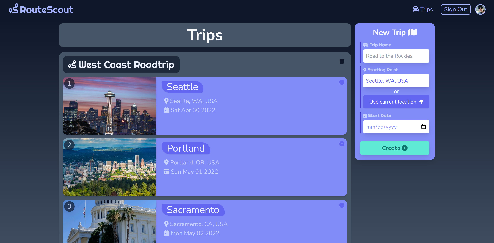
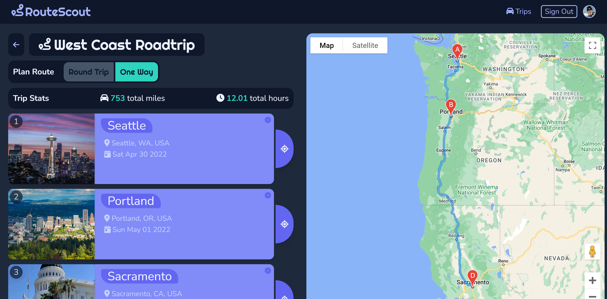

# Module 2 Group Assignment

CSCI 5117, Spring 2022, [assignment description](https://canvas.umn.edu/courses/291031/pages/project-2)

## App Info:

* Team Name: Better Goodreads
* App Name: RouteScout
* App Link: https://routescout-1ac17.web.app/

### Students

* Daniel Black, blac0352@umn.edu
* Ryan Alexander, alexa907@umn.edu
* Junsoo Choi, choix712@umn.edu

## Key Features

**Describe the most challenging features you implemented
(one sentence per bullet, maximum 4 bullets):**

* Allowing users to click a button to use their devices current location as the origin location of a trip.
* Using the Google Maps Direction API to create and draw routes on a map for users

Which (if any) device integration(s) does your app support?

* Our app utilizes the location services of a users device.

Which (if any) progressive web app feature(s) does your app support?

* ...

## Mockup images

Mobile Screen Mockups showing:

* Top Left: Trip Editor Screen with ability to reorder locations and click on each one to open the editing screen
* Top Right: Location Editor Screen to edit details of a location
* Bottom Left: Trip Viewer Screen/Profile where user can see all their trips or create a new one
* Bottom Right: Trip Map Screen where user can see their locations mapped via Google Maps and get directions

Desktop Screen Mockups showing:

* Top: Trip Editor Screen with location order side by side with map of trip
* Bottom: Trip Editor Screen with location editor pulled up instead of map of trip

## Testing Notes

**Is there anything special we need to know in order to effectively test your app? (optional):**

* No

## Screenshots of Site (complete)

### Landing Page
This is just a straightforward landing page with a spinning earth icon for fun. Users can sign in with Google by clicking on the Sign In button in the upper right corner.

### Trips Page
Users can create, edit, and delete trips from this page. They can add destinations to existing trips and can also delete destinations from trips. Users can click the "User current location" button to use their devices location as the starting point of a new trip. Users can hover over the thumbnail image for a destination and if the place has more than one photo, arrow buttons will pop up allowing a user to swap the thumbnail image. The minus button in the upper right corner of a trip will render a "Delete" and "Cancel" button when clicked. Those two buttons behave as you'd expect. Users can navigate to the Trip Page by clicking on the name of a trip. They can also navigate to a Destination Page by clicking a destination name within a trip.

### Trip Page
This page renders a map with markers at trip destinations. A user can center the map on a location by clicking the half-moon shape button to the right of the destination preview component. A reset map button will then pop up below the destinations. Users can click reset map to recenter the map at the average of the latitudes and longitudes of all the destinations. Users can plot a route by clicking either the "RoudTrip" or "One Way" button. The route will be rendered on the map and the TripStats component will be shown. The back button in the upper left will take a user back to the previous page. Like before, users can hover over image thumbnails and click through alternates. They can also click on a destination name to go the Destination Page for that destination.

### Destination Page
The Destination Page shows details about a place, such as the `address` the `arrivalDate`, and `order` number. Current weather data is supplied by the [OpenWeatherMap](https://openweathermap.org/api) API. If a place has photos, they will be shown in a big carousel at the bottom. The map on the right side centers on the destination. A user can return to the previous page by clicking the back button. 

## External Dependencies

**Document integrations with 3rd Party code or services here.
Please do not document required libraries (e.g., Vue, Vuefire, Firebase).**

* font-awesome: used for icons
* gmap-vue: an active fork of vue2-google-maps
* vue2-google-maps: access to google maps apis and native vue google maps components
  - Google Places, Geocoding, and Directions APIs were used
* axios: making ajax calls to weather API
* [OpenWeatherMap](https://openweathermap.org/api): weather API for populating DestinationView

**If there's anything else you would like to disclose about how your project
relied on external code, expertise, or anything else, please disclose that
here:**

...

## Running and Building
`git clone https://github.com/csci-5117-S22/project-2-goodreads2.git`

Open up the project in VS Code or whatever text editor you like. Recommend moving into the routescout directory before opening up the project so you can avoid
issues like trying to run `npm run serve` from the project-2-goodreads2 directory. 

`cd project-2-goodreads2/routescoute`

Install dependencies:

`npm i`

Get Tailwind CLI tool going:

`npx tailwindcss -i ./src/input.css -o ./src/output.css --watch`

Create a .env.local file based off of the example and add your Google Maps API Key:

`VUE_APP_GOOGLE_MAPS_API_KEY="{{INSERT KEY HERE}}"`

Run project locally:

`npm run serve`

When you're ready to build and deploy:

`npm run build`

`firebase deploy`

The deploy command should finish running and provide you with a link to the hosted app, [routescout](https://routescout-1ac17.web.app/)
